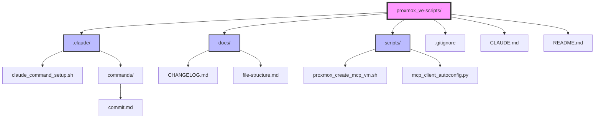

# Project File Structure

This document provides a visual representation of the ProxMox VE Scripts project structure.

## Directory Structure

## File Descriptions

### Root Directory

- **`.gitignore`** - Git ignore patterns for Python, IDE, and temporary files
- **`CLAUDE.md`** - Comprehensive project documentation for Claude Code AI assistant
- **`README.md`** - Project overview and quick start guide

### `.claude/` Directory

- **`claude_command_setup.sh`** - Setup script for Claude custom commands
- **`commands/`** - Custom Claude command definitions
  - **`commit.md`** - Smart commit command with version management

### `docs/` Directory

- **`CHANGELOG.md`** - Version history following semantic versioning
- **`file-structure.md`** - This file - visual project structure documentation

### `scripts/` Directory

- **`proxmox_create_mcp_vm.sh`** - Main automation script for VM creation and MCP server deployment
- **`mcp_client_autoconfig.py`** - Python script for automatic MCP client configuration
