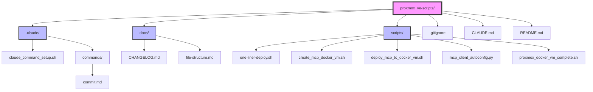

# Project File Structure

Last updated: 2025-07-04

This document provides a visual representation of the ProxMox VE Scripts project structure.

## Directory Structure

## File Descriptions

### Root Directory

- **`.gitignore`** - Git ignore patterns for Python, IDE, and temporary files
- **`CLAUDE.md`** - Comprehensive project documentation, best practices, and usage guidelines for Claude Code
- **`README.md`** - Project overview, quick start guide, and references to Jupyter notebooks

### `.claude/` Directory

- **`claude_command_setup.sh`** - Setup script for Claude custom commands
- **`settings.local.json`** - Local Claude settings and preferences
- **`commands/`** - Custom Claude command definitions
  - **`commit.md`** - Smart commit command with version management

### `docs/` Directory

- **`CHANGELOG.md`** - Version history following semantic versioning
- **`file-structure.md`** - This file - visual project structure documentation

### `scripts/` Directory

- **`one-liner-deploy.sh`** - Complete one-command deployment of Docker VM + MCP servers
- **`create_mcp_docker_vm.sh`** - Creates Docker VM using ProxmoxVE Community Scripts
- **`deploy_mcp_to_docker_vm.sh`** - Deploys MCP servers to an existing Docker VM
- **`mcp_client_autoconfig.py`** - Python script for automatic MCP client configuration
- **`proxmox_docker_vm_complete.sh`** - Alternative complete Docker VM creation with Portainer
