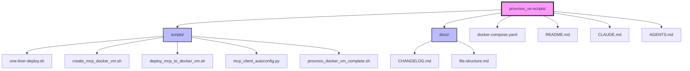

# Project File Structure

Last updated: 2025-07-04

This document provides a visual representation of the ProxMox VE Scripts project structure.

## Directory Structure



## Directory Structure Tree

```
proxmox_ve-scripts/
├── AGENTS.md                          # Development guidelines and code style
├── CLAUDE.md                          # Claude Code guidance and commands
├── README.md                          # Project overview and quick start
├── docker-compose.yaml                # Docker Compose config for MCP servers
├── docs/
│   ├── CHANGELOG.md                   # Version history and changes
│   └── file-structure.md             # This file - project structure
└── scripts/
    ├── create_mcp_docker_vm.sh       # VM creation using ProxmoxVE Community
    ├── deploy_mcp_to_docker_vm.sh    # MCP server deployment script
    ├── mcp_client_autoconfig.py      # Client auto-configuration tool
    ├── one-liner-deploy.sh           # Complete deployment entry point
    └── proxmox_docker_vm_complete.sh # Alternative VM creation with Portainer
```

## File Descriptions

### Root Directory

- **`AGENTS.md`** - Development guidelines, build commands, and code style rules for contributors
- **`CLAUDE.md`** - Comprehensive project documentation, common commands, and architecture details for Claude Code
- **`README.md`** - Project introduction, quick start guide, and usage instructions
- **`docker-compose.yaml`** - Defines MCP services (Context7, Desktop Commander, Filesystem MCP)

### `docs/` Directory

- **`CHANGELOG.md`** - Semantic versioning changelog following Keep a Changelog format
- **`file-structure.md`** - This file - visual and textual representation of project structure

### `scripts/` Directory

- **`one-liner-deploy.sh`** - Main automation script that orchestrates VM creation and MCP deployment
- **`create_mcp_docker_vm.sh`** - Wrapper around ProxmoxVE Community docker-vm.sh script
- **`deploy_mcp_to_docker_vm.sh`** - Deploys MCP servers to an existing Docker VM
- **`mcp_client_autoconfig.py`** - Python script for auto-configuring AI clients
- **`proxmox_docker_vm_complete.sh`** - Alternative approach using custom Debian image with Portainer
